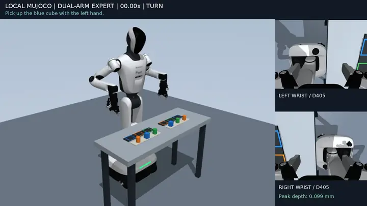
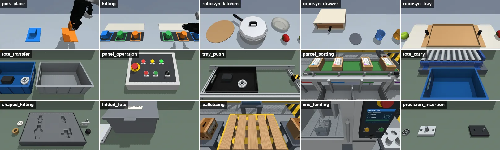
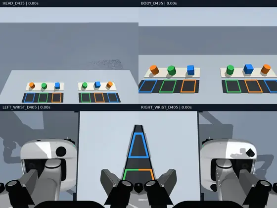

# Franzi 双臂操作仿真 Benchmark

在汇川（Inovance）Franzi 轮式双臂机器人上评测双臂操作策略（VLA、模仿学习）的 MuJoCo 仿真 benchmark，运行在 macOS 上。

- **按真机对齐**：运动学、关节限位和速度上限来自真机控制器的资料，夹爪按 CAD 连杆运动，四路相机装在真机的位置上。
- **和真机同一套接口**：仿真端实现了原厂 SDK 的服务（`simbridge/`），上层程序换一个连接配置，就能在仿真和真机之间切换。
- **19 个任务**：从双臂轮流抓放，到厨房、抽屉、购物篮、实验台这类多步骤长任务，再到 10 个工业工位场景。
- **示教数据**：脚本专家用特权信息完成任务，录下四路相机画面和 16 维动作，导出为 LeRobot 数据集。

<p align="center">
  
</p>
<p align="center">分拣装盘（8 倍速），右侧小图是两路腕部相机</p>

<p align="center">
  
</p>
<p align="center">15 个场景的躯干 D435 画面。第一行：抓放和分拣装盘（任务进行中）、三个 RoboSyn 场景（初始状态）；下面两行是 10 个工业场景</p>

## 任务

### 有专家和成功判定的任务

| 任务 | 内容 | 一集 | 专家 |
|---|---|---|---|
| `pick_place` | 左手、右手依次把蓝、橙两个物块放到中间的目标垫上 | 43 s | 成功（布局固定） |
| `kitting` | 每只手把方块、圆柱和六角柱放进料盘里同色的格子，两只手轮流，分 3 个回合 | 110–163 s | 20/20 |
| `robosyn_kitchen`（cook） | 揭开锅盖，指定的食材下锅，另一样装盘，再盖回锅盖，按铃 | 84–104 s | 待重做 |
| `robosyn_kitchen`（swap） | 揭开锅盖，锅里的食材换到盘里，桌上的放进锅，盖回锅盖，按铃 | 105–127 s | 待重做 |
| `robosyn_drawer`（store） | 拉开抽屉，两只手经交接垫传递烧杯，放进抽屉，关上，按铃 | 66–72 s | 待重做 |
| `robosyn_drawer`（retrieve） | 从抽屉取出烧杯，经交接垫放回桌上原位，关上抽屉，按铃 | 71–76 s | 待重做 |
| `robosyn_tray` | 两样食材放进托盘，两只手一起端起托盘，平移到指令说的一侧 | 49–53 s | 待重做 |
| `robosyn_basket` | 牛奶放进藤编篮，一只手侧抓提手把篮子提到指令说的一侧，再把牛奶取出放到收银台 | 98–146 s | 待重做 |
| `robosyn_lab` | 烧杯放上磁力搅拌器，按指定旋钮启动、搅拌 3 s 后再按停止，烧杯移到托盘 | 61–70 s | 待重做 |

- 专家一栏是 20 个随机种子里的成功数，每个种子第一次采样就可解。
- 2026-10-25 机器人模型换成 `wheel_robot_26.8.16_3`（夹爪是独立连杆，长 12 mm）。抓放和分拣装盘在新模型上按 subtask 重写：每段只有一只手对一个物体做一个动作，另一只手不动，结果是新模型上的。RoboSyn 五个场景的专家还是旧模型上写的，在新模型上准备阶段指尖就碰到桌面，要重做；表里的时长是旧模型上的。
- 2026-10-25 起检测手臂与躯干之间的碰撞，成功也要求全程零碰撞。旧模型上，厨房、抽屉、篮子的专家在中线附近干活时，前臂或手腕会顶到胸口。
- 除 `pick_place` 外，每个种子随机化物体的位置、朝向和分配，以及指令的措辞。
- RoboSyn 五个场景用的是 RoboSynChallenge 比赛的道具。各任务的布局、专家规则、成功判定和结果见 [docs/tasks.md](docs/tasks.md)。

### 工业场景

10 个工业工位场景，道具用 Blender 建模，工作台高 0.90 m。2026-10-25 按机器人的实际能力改过一轮：布局、间隙和抓法都按 95 mm 的夹爪和手臂的可达范围定。场景都通过了场景检查：静置不漂移，穿透不超过 0.09 mm，关键操作点都够得到，要夹的点还查了夹爪开口和壳体间隙。10 个场景都有脚本专家（2026-10-25），在当前机器人模型 `wheel_robot_26.8.16_3` 上运行。2026-10-27 放大布局随机化后，MuJoCo 里 40 个种子、Isaac 里闭环 3 个种子都成功：物体挪几厘米、转几十度，料箱、托盘和工装本身也挪动和转动。每集都能按 subtask 切开，每段只有一只手对一个物体做一个动作，只有双手搬同一个物体时两只手一起动。示教数据在 Isaac Sim 里闭环采集：每个场景 200 条，布局和光照按种子随机，共 2000 条、约 47 小时。10 个场景都已搭到 Isaac Sim 5.1 上（PhysX 物理、RTX 渲染），见 [docs/isaac.md](docs/isaac.md)。详见 [docs/benchmark.md](docs/benchmark.md)。

| # | 场景 | 难度 | 内容 | 手臂 |
|---|---|---|---|---|
| 1 | `tote_transfer` | 简单 | 从蓝色料箱取法兰盘，放进灰色料箱 | 左 |
| 2 | `panel_operation` | 简单 | 旋钮拨到 AUTO，再按绿色启动按钮，不碰急停 | 右 |
| 3 | `tray_push` | 简单 | 沿导轨把防静电托盘推到挡块，托盘里的零件不能洒 | 左 |
| 4 | `parcel_sorting` | 中等 | 输送线上 4 个包裹按面单分区放进对应格口，每只手管自己一侧的两个格口 | 双手轮流，各管一半 |
| 5 | `tote_carry` | 中等 | 两只手各夹周转箱一端的箱壁，把它搬到后方的辊道上 | 双手一起 |
| 6 | `shaped_kitting` | 中等 | 4 个零件按形状和朝向放进泡棉的凹槽（每边间隙 4 mm） | 双手轮流，各管两个 |
| 7 | `lidded_tote` | 中等 | 掀开带盖周转箱，取出六角坯放到工位板，再合上盖 | 左 |
| 8 | `palletizing` | 困难 | 4 个纸箱按立牌上的垛型码到托盘上 | 双手轮流，各管两个 |
| 9 | `cnc_tending` | 困难 | 开门，换下虎钳里的成品、装上毛坯，关门，按循环启动 | 双手轮流，需要交接 |
| 10 | `precision_insertion` | 困难 | 轴承套到轴上，销钉换到另一个孔（直径间隙都是 1.0 mm，带导向） | 先左手轴承，再右手销钉 |

## 评测约定

<p align="center">
  
</p>
<p align="center">策略看到的四路相机（5 倍速）：上排头部和躯干 D435，下排左右腕 D405</p>

- **观测**：四路机载相机的 RGB 画面（640×480，25 Hz），16 维本体状态（左右臂各 7 个关节角，左右夹爪闭合度），一句任务指令。物体真值只给专家和评分用，不能作为策略输入。
- **动作**：16 维，25 Hz：14 个手臂关节的目标角和两个夹爪的闭合度。底盘固定，腰腿和头部不动。
- **物理**：MuJoCo 500 Hz。机器人每个连杆用 STL 凸包碰撞，两臂之间、手臂和躯干之间也检测碰撞。任一接触穿透超过 1 mm，或关节越限超过 0.002 rad，这一集立即判失败。仿真本身崩溃的一集作废，换种子重来，不计入成功率；崩溃指状态不是有限值、接触缓冲溢出、物体被弹飞。
- **成功**：每个任务有自己的判定，一般要求物体到位、静止、不碰机器人，并保持至少 15 个控制拍；写在各场景的 `run.py` 和 `check.py` 里。全程不能有碰撞：机器人只能用手碰要操作的东西，用底盘和轮子碰地面；搬运中的物体只能碰机器人。
- **接口**：上层程序经原厂 SDK 驱动仿真服务端，调用方式和真机相同。原厂 SDK 验收在 MuJoCo 两种主循环下全部通过：通信 28/28，控制语义 37/37，运动学接口 23/23，物理表现 10/10，故障处理 5/5。

还没有的：

- 统一的策略评测入口（每集的时间上限、评测用的种子、打分汇总），以及学习策略的基线。FineART 还没有加载。
- 真机：没有连接过，坐标映射、零位和 TCP 只核对到离线资料；相机内参未标定，没有深度图。SDK 仿真服务端的 Isaac Sim 后端还是草稿，冒烟测试停在关节限位核对上。

## 快速开始

需要 macOS 和 conda（mamba）。新建环境 `inovance-fineart`：

```bash
mamba create -n inovance-fineart -c conda-forge python=3.12 pip
mamba activate inovance-fineart
pip install mujoco==3.13.0 numpy==2.2.6 scipy==1.18.1 trimesh==5.1.0 av==15.1.0 \
  pillow==12.3.0 PyYAML==6.0.3 networkx==3.6.1 pytest==8.4.2 pin==3.4.0 \
  cmeel-urdfdom==4.0.1 cmeel-tinyxml2==10.0.0
```

`cmeel-urdfdom` 必须固定在 4.0.1：pin 3.4.0 链接的是 urdfdom 4.0，不固定时 pip 会装 6.0.0，Pinocchio 就无法导入。

在仓库根目录运行，`--output` 要指向一个还不存在的目录：

```bash
# 有专家的任务：跑一集（加 --record 另写 6 条视频），再做多种子验收
python -m scenes.kitting.run --output outputs/kitting_seed0 --seed 0 --record
python -m scenes.kitting.check --output outputs/kitting_check --seeds 20
python -m scenes.robosyn_kitchen.run --output outputs/kitchen_seed0 --seed 0 --record   # 加 --variant swap 是换菜
python -m scenes.pick_place.run --output outputs/pick_place --record
python -m scenes.pick_place.check outputs/pick_place

# 工业场景：搭场景、静置，检查可达性、能不能夹和相机，写 preview.png 和 report.json
python -m scenes.tote_transfer.check --output outputs/bench_check/tote_transfer

# 不依赖物理引擎的测试
python -m pytest tests -q
```

- 专家失败时进程仍以 0 退出，结果要看运行目录里 `summary.json` 的 `success` 和 `error`。
- 每次运行写 `scene.xml`、`summary.json`、`trace.json`（每个控制拍的阶段、动作、状态和物体真值）和 `trajectory.npz`；`--record` 另写总览 `expert.mp4`、四宫格 `cameras.mp4` 和四路相机的原始视频。
- 录好的运行可以转成 LeRobot v2.1 数据集（openpi 一系直接可读），也可导出 v3.0，两版可以无损互转，见 [docs/vla_data.md](docs/vla_data.md)。
- 仓库里没有的第三方资料：RoboSynChallenge 道具的原始文件（`assets/robosyn/`，RoboSyn 五个场景要用）；原厂 SDK 和控制器镜像（`sdk_review/`，原厂 SDK 的连接、SDK 验收和读取镜像的测试要用）。

## 目录

| 路径 | 内容 |
|---|---|
| `scenes/` | 每个场景一个包：`task.py` 布局和物体，`run.py` 专家和命令行，`check.py` 验收 |
| `sim/` | 各场景共用：机器人场景 `build_task.py`，仿真主循环和逐步审计 `episode.py`，相机 `camera_rig.py`，外观、夹爪连杆和腕部相机块；道具和工位 `props.py`、`robosyn.py`、`prop_assets.py`、`workcell.py`，桌面搬运 `tabletop.py`；验收 `scene_check.py`、`bench_check.py` |
| `robot_kinematics.py` | 共享正逆解（Pinocchio），专家、SDK 服务端和主机侧笛卡尔控制都用它 |
| `simbridge/` | 原厂 SDK 的仿真服务端 |
| `sdk/` | 原厂 SDK 的连接、SDK 验收、主机侧笛卡尔控制和离线运动学核对 |
| `data/` | 示教数据的录制、专家运行的转换和 LeRobot 导出 |
| `config/` | 机器人与 SDK 的映射、连接和后端配置、规划约束原件、SDK 验收程序 |
| `assets/` | 源模型 `franzi_source/`（原样，不改），外观网格，RealSense 相机模型，工业道具 `props/` |
| `tools/blender/` | 工业道具的 Blender 构建脚本 |
| `hardware/wrist_d405_mount/` | 腕部 D405 转接座的设计 |
| `tests/` | 不依赖物理引擎的 pytest |
| `docs/` | 详细文档和 README 的图 |

## 文档

- [工业场景](docs/benchmark.md)：10 个场景的内容、场景检查、布局约束和已知问题；道具建模规格在 [docs/benchmark_props.md](docs/benchmark_props.md)
- [任务与专家](docs/tasks.md)：有专家的任务的布局、专家规则、成功判定、数据约定和当前结果
- [机器人模型](docs/robot_model.md)：源文件、派生场景和碰撞体、夹爪连杆、运动学、关节限位和伺服、相机、外观和灯光
- [原厂 SDK 仿真服务端](docs/sdk_bridge.md)：分层、控制语义、坐标映射、运动学接口和验收
- [VLA 数据](docs/vla_data.md)：经原厂 SDK 录制、转换专家运行、导出 LeRobot 数据集
- [控制器镜像离线检查](docs/controller_image.md)
- [历次版本](docs/history.md)：每一版改了什么、当时的结果和结论

## 版权

本仓库没有开源许可证，保留所有权利：欢迎查看，未经许可不得使用、修改或转载。第三方素材：RealSense 相机模型（来源和许可见 `assets/appearance/cameras/*/SOURCE.json`）；RoboSynChallenge 的道具（来源见 [docs/tasks.md](docs/tasks.md)，原始文件不在仓库里）。
